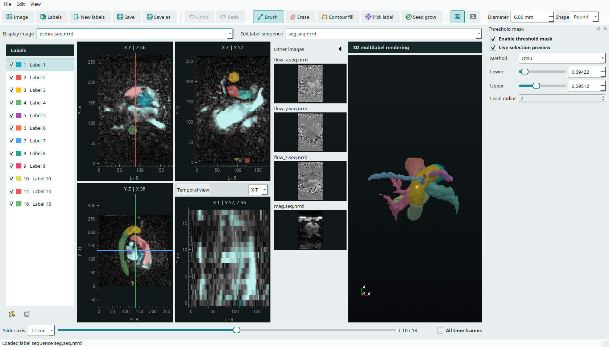

# SpatioTemporal Labeler

<p align="center">
  
</p>

[](https://github.com/AssociatedPrimeIdeal/SpatioTemporalLabeler/actions/workflows/ci.yml)
[](https://github.com/AssociatedPrimeIdeal/SpatioTemporalLabeler/releases/latest)
[](https://www.python.org/)
[](LICENSE)

SpatioTemporal Labeler is a cross-platform desktop editor for 3D and 3D+t medical image segmentation, including 4D flow MRI workflows. It combines linked spatial and temporal views with real-time 3D label rendering and metadata-preserving NRRD/NIfTI I/O.



## Features

- Linked X-Y, X-Z, Y-Z, and selectable X-T/Y-T/Z-T views
- Throttled 3D rendering that follows time-slider movement
- Multiple image sequences, label sequences, and integer labels
- Unified image/label import classification, drag-and-drop, and collapsible previews for other loaded images
- Physical round or square brush and eraser footprints
- Closed-contour raster drawing with interior fill
- Right-drag temporary erase, Shift-hover linked positioning, and Shift-drag/middle-drag panning
- Optional all-time-frame spatial editing as one undoable operation
- Independent threshold mask with live lower/upper sliders, automatic methods, preview, and bypass
- Live window level/width sliders in a separate display panel
- 2D/3D seed region growing that stops at other labels
- Per-label morphology with physical `mm` radii and `mm³` component volumes
- Physical signed-distance interpolation between user-selected label keyframes
- Automatic all-frame replication or selected-frame placement when mapping 3D labels to a 4D image
- Independent closed, smoothed, decimated surface rendering for each label
- Metadata-preserving read/write for 3D/4D NRRD and NIfTI files
- English and Simplified Chinese interface

## Install

### Portable Application

Download the package for your platform from the [latest release](https://github.com/AssociatedPrimeIdeal/SpatioTemporalLabeler/releases/latest). Portable packages include Python, Qt, VTK, and all runtime dependencies.

| Platform | Release asset | Run |
| --- | --- | --- |
| Windows 10/11 x64 | `SpatioTemporalLabeler-<version>-windows-x64.zip` | Extract and open `SpatioTemporalLabeler/SpatioTemporalLabeler.exe` |
| Linux x86_64 | `SpatioTemporalLabeler-<version>-linux-x86_64.tar.gz` | Extract and run `SpatioTemporalLabeler/SpatioTemporalLabeler` |

Each package also contains per-user install and uninstall scripts. No administrator access is required.

### Python Package

Every release includes a pure Python wheel and source distribution. Install the current release directly from GitHub:

```bash
python -m pip install "https://github.com/AssociatedPrimeIdeal/SpatioTemporalLabeler/releases/download/v0.1.0/spatiotemporal_labeler-0.1.0-py3-none-any.whl"
```

Alternatively, download the wheel from the release and install it locally:

```bash
python -m pip install spatiotemporal_labeler-0.1.0-py3-none-any.whl
```

Launch the installed application with `spatiotemporal-labeler`. Python 3.9 or newer is required. Runtime dependencies are installed automatically by pip.

## Start With Sample Data

The repository includes an 18-frame PCMRA image and matching label sequence in `examples/sample-data`.

```bash
spatiotemporal-labeler examples/sample-data
```

When a directory is provided, every direct `.nrrd`, `.nii`, and `.nii.gz` file is loaded. Files whose names contain `seg`, `mask`, or `label` are opened as label sequences; the remaining files are opened as image sequences.
When present, `pcmra.seq.nrrd` is selected as the initial display image and `seg.seq.nrrd` as the initial label sequence.

You can also launch without arguments and load or drop NRRD/NIfTI files:

```bash
spatiotemporal-labeler
```

## Controls

| Input | Action |
| --- | --- |
| Left drag | Use the selected brush, eraser, or contour tool |
| Right drag | Temporarily erase without changing the selected tool |
| Hold Shift and move | Move the linked spatial cursor without editing |
| Shift + left drag | Pan a 2D view |
| Middle drag | Pan a 2D view |
| Ctrl + wheel | Zoom a 2D view |
| Shift + wheel | Change brush or eraser diameter |
| Wheel in a spatial view | Change its orthogonal slice |
| Double-click | Confirm a pending contour, otherwise fill/restore the entire 2x2 view panel |
| `B`, `E`, `L`, `G` | Brush, eraser, contour, or seed grow |
| Hold `I` and move | Pick labels continuously without changing the selected tool |
| `R` | Reset 2D zoom and pan |
| Left / Right | Step through time frames |
| Hold `CapsLock` | Temporarily apply spatial edits to all frames |
| Hold `Q` | Bypass an enabled threshold mask while drawing or erasing |
| `Ctrl+Z`, `Ctrl+Y` | Undo or redo |
| `Esc` | Cancel a pending contour |

Enable **All time frames** to repeat one spatial gesture at the same X/Y/Z coordinates in every frame. Temporal-view edits always affect the exact time pixels drawn.

## Data Contract

Image and label sequences are normalized internally to canonical RAS `[X,Y,Z,T]`; 3D sources use a singleton T axis. Saving reverses the source transform and preserves the original dimensionality and relevant NRRD/NIfTI metadata. When a spatially matching 3D label sequence is opened over a 4D image, it can be copied to every frame (the default) or placed in one selected frame; the mapped result becomes a new unsaved 4D label sequence. Other editing requires a matching voxel grid.

## License

SpatioTemporal Labeler is distributed under the [GNU General Public License v3.0](LICENSE).
