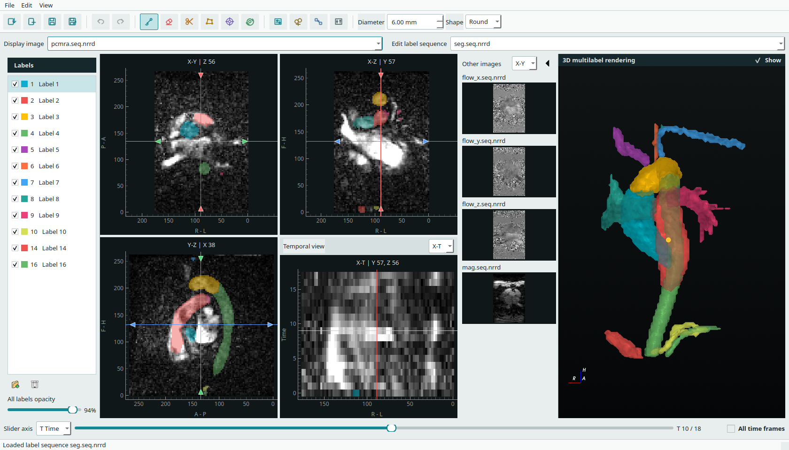

# SpatioTemporal Labeler: 4D Medical Image Segmentation Editor

<p align="center">
  
</p>

[](https://github.com/AssociatedPrimeIdeal/SpatioTemporalLabeler/actions/workflows/ci.yml)
[](https://github.com/AssociatedPrimeIdeal/SpatioTemporalLabeler/releases/latest)
[](https://www.python.org/)
[](LICENSE)

SpatioTemporal Labeler is a cross-platform desktop editor for manual and semi-automatic 3D/4D medical image segmentation. It supports dynamic and time-resolved MRI, including 4D flow MRI, in NIfTI and NRRD files, with linked spatial-temporal views, real-time 3D label rendering, temporal propagation, and metadata-preserving I/O.



## Features

- Linked X-Y/X-Z/Y-Z spatial and X-T/Y-T/Z-T temporal views with a shared X/Y/Z/T cursor
- Peak-signal frame selection, time navigation, and display-only temporal-axis stretch
- Current-frame or all-frame label editing with physical brush/eraser footprints and one-gesture undo
- Copy and paste complete frames or only the active label within a label sequence with configurable shortcuts and one-step undo
- Interpolate selected labels between two keyframes with physical signed distance fields while preserving other labels as barriers
- Interpolate across the time-axis end by default, treating periodic sequences as a cyclic path between the chosen keyframes; the option can be disabled for non-periodic segments
- Automatically estimate and display systole start, systolic peak, and diastole-start phase guides while keeping label keyframes user-defined
- Named frame markers below the time slider: cardiac phases are automatic, `K` adds manual markers, clicking jumps to a frame, right-clicking changes colour or deletes a marker, and checked markers can be used as interpolation keyframes
- Add any number of user-edited label keyframes and interpolate every gap across the full periodic sequence in one undoable operation
- Adjacent-frame temporal propagation using physical displacement, intensity matching, and label/threshold barriers
- Synchronized 2D overlays and independently colored 3D label surfaces while navigating time
- Separate threshold-mask constraints with all-frame editing and threshold-bypass modes
- Multiple image/label sequences with RAS-mapped previews and 3D-label-to-4D frame mapping
- Metadata-preserving 3D/4D NRRD and NIfTI read/write

## Install

### Portable Application

Download the package for your platform from the [latest release](https://github.com/AssociatedPrimeIdeal/SpatioTemporalLabeler/releases/latest). Portable packages include Python, Qt, VTK, and all runtime dependencies.

| Platform | Release asset | Run |
| --- | --- | --- |
| Windows 10/11 x64 | `SpatioTemporalLabeler-<version>-windows-x64.zip` | Extract and open `SpatioTemporalLabeler/SpatioTemporalLabeler.exe` |
| Linux x86_64 | `SpatioTemporalLabeler-<version>-linux-x86_64.tar.gz` | Extract and run `SpatioTemporalLabeler/SpatioTemporalLabeler` |

Each package also contains per-user install and uninstall scripts. No administrator access is required.

### Python Package

Every release includes a pure Python wheel and source distribution. Install the current release directly from GitHub:

```bash
python -m pip install "https://github.com/AssociatedPrimeIdeal/SpatioTemporalLabeler/releases/download/v0.4.6/spatiotemporal_labeler-0.4.6-py3-none-any.whl"
```

Alternatively, download the wheel from the release and install it locally:

```bash
python -m pip install spatiotemporal_labeler-0.4.6-py3-none-any.whl
```

Launch the installed application with `spatiotemporal-labeler`. Python 3.9 or newer is required. Runtime dependencies are installed automatically by pip.

## Start With Sample Data

The repository includes an 18-frame PCMRA image and matching label sequence in `examples/sample-data`.

```bash
spatiotemporal-labeler examples/sample-data
```

When a directory is provided, every direct `.nrrd`, `.nii`, and `.nii.gz` file is loaded. Files whose names contain `seg`, `mask`, or `label` are opened as label sequences; the remaining files are opened as image sequences.
When present, `pcmra.seq.nrrd` is selected as the initial display image and `seg.seq.nrrd` as the initial label sequence. A 4D image initially opens on the earliest frame with the largest whole-frame sum of absolute finite voxel intensities; `NaN` and infinite values are ignored.

You can also launch without arguments and load or drop NRRD/NIfTI files:

```bash
spatiotemporal-labeler
```

## Default Keyboard Shortcuts

| Input | Action |
| --- | --- |
| `B`, `E`, `S`, `L`, `G` | Brush, eraser, scissors lasso, contour fill, or temporal propagation |
| Hold `I` / `H` | Pick labels / hide 2D label overlays |
| Press/release `CapsLock`, `Q`, or `W` | Toggle all-frame threshold-constrained, current-frame threshold-bypass, or all-frame threshold-bypass editing; hold during a stroke for a temporary mode |
| `[` / `]` | Decrease/increase brush or eraser diameter |
| `Left` / `Right` | Previous/next time frame (wraps from the last frame to the first and back) |
| `Up` / `Down` | Next/previous orthogonal spatial slice |
| `V` | Cycle X-T/Y-T/Z-T display-only time-axis stretch (1x/2x/4x) |
| `K` | Add a named marker to the current time frame |
| `R` | Reset the hovered preview or the main 2D views |
| `Ctrl+C` / `Ctrl+V` | Copy the current frame's labels / paste them into the current frame |
| `Ctrl+Shift+Left` / `Ctrl+Shift+Right` | Copy the previous/next frame into the current frame |
| `View > Interpolate` | Open the keyframe label interpolation panel |
| `Enter` / `Esc` | Apply a pending contour / cancel a contour or lasso |
| `Ctrl+S` / `Ctrl+Shift+S` | Save / save as |
| `Ctrl+W` | Close all loaded files |
| `Ctrl+Z` / `Ctrl+Y` / `Ctrl+Shift+Z` | Undo / redo |

## Mouse Gestures

| Input | Action |
| --- | --- |
| Left drag | Use the selected editing tool in a spatial view |
| Right drag | Temporarily erase without changing the selected tool |
| Hold `Shift` and move / `Shift` + left drag | Locate the shared cursor / pan a 2D view |
| Middle drag in 2D / middle or right drag in 3D | Adjust window width and window level / pan and zoom |
| `Ctrl` + wheel / `Shift` + wheel | Zoom a 2D view / change brush diameter |
| Wheel in a spatial view | Change its orthogonal slice |
| Alt + left drag in 3D | Rotate the 3D camera |
| Double-click | Activate an image preview, change a label color, maximize a view, or confirm a contour depending on the target |
| Drag a locator-line arrow | Move the linked X, Y, or Z cursor coordinate |

Enable **All time frames** to apply ordinary spatial gestures in every frame. Temporal propagation has its own default all-frame range and does not use this option. It begins from a spatial-view source patch, then independently matches each voxel only into adjacent frames; it does not grow within a frame and stops in a direction after an unmatched frame.

## Data Contract

Image and label sequences are normalized internally to canonical RAS `[X,Y,Z,T]`; 3D sources use a singleton T axis. Saving reverses the source transform and preserves the original dimensionality and relevant NRRD/NIfTI metadata. When a spatially matching 3D label sequence is opened over a 4D image, it can be copied to every frame (the default) or placed in one selected frame; the mapped result becomes a new unsaved 4D label sequence. Other editing requires a matching voxel grid.

## License

SpatioTemporal Labeler is distributed under the [GNU General Public License v3.0](LICENSE).
